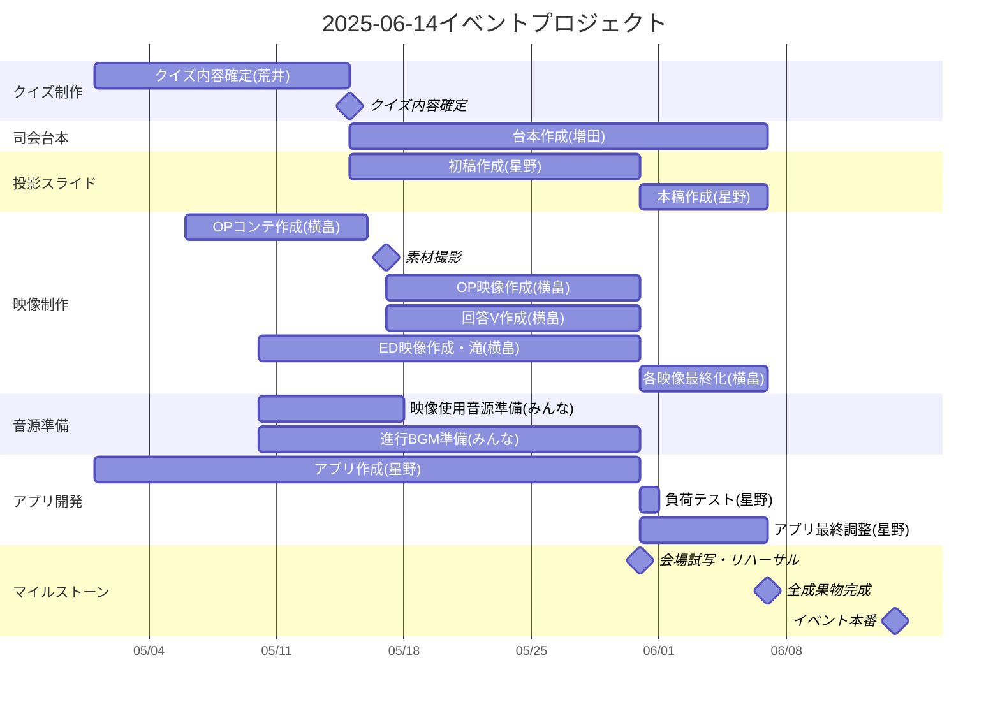

# 会議の目的
- タスク感・スケジュール感を共通認識にする
- 今後にむけて確認すべきことを洗い出す

# WBS

## プロジェクト期間
- 開始日: 2025年5月1日
- 終了日: 2025年6月14日（イベント本番）
- 全作業完了日: 2025年6月7日
  
## クリティカルパス
主なクリティカルパスは以下の通りです：
1. OPコンテ作成 → 素材撮り → 映像作成 → 各映像最終化 → イベント本番
2. アプリ作成 → 負荷テスト → アプリ最終調整 → イベント本番

## リスク管理ポイント
1. 5月17日の素材撮りは全員参加の重要なマイルストーンとなります
2. 5月31日の会場試写・リハーサルまでに初期成果物を完成させる必要があります
3. 映像制作の一部（回答V）は外注の可能性があり、早めの判断が必要です 

# Q&A
- PCの音源をPA卓から流せる？
	- 流せる。
- 音声の接続用ケーブルは？HDMIから音声拾う形式？オーディオケーブルが必要？
- 5/31(土)の会場試写は我々も参加可能？（リハできるか？）
